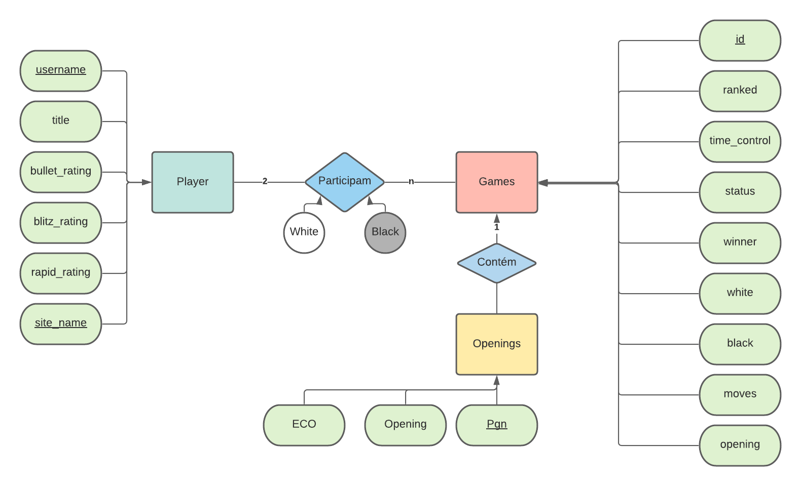
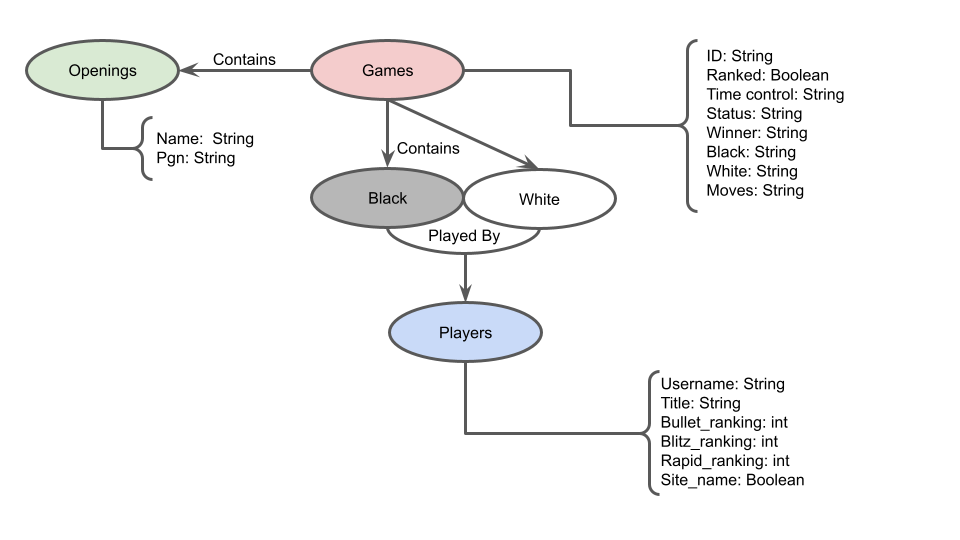
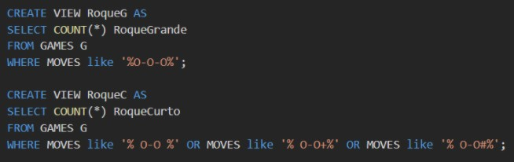
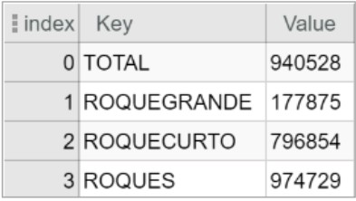
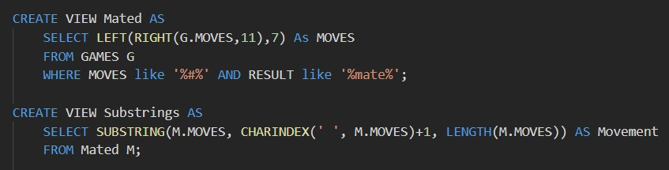
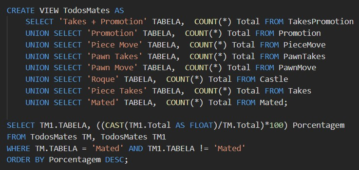
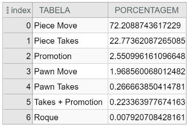
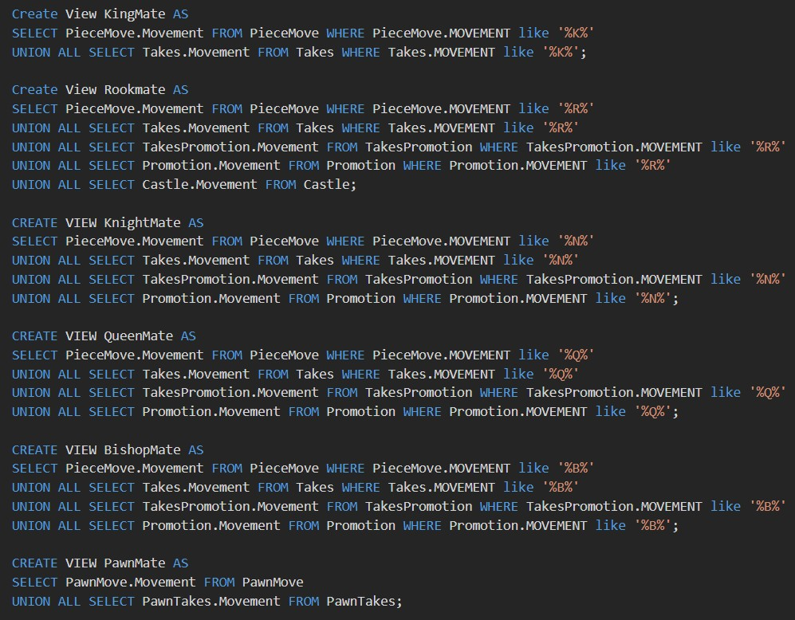
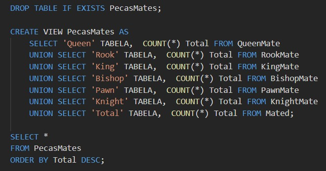
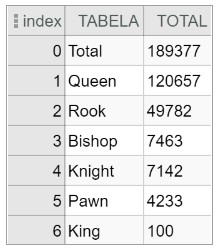

# Modelo para Apresentação da Entrega Prévia do Projeto

# Projeto `<BispOSet: Chess Match and Titled Player Statistic Organized Dataset>`

# Equipe `BispOSet` - `BOSS`
* `Breno Nunes Tavares` - `RA: 232238`
* `Eduardo Carvalheira Teixeira de Aguiar` - `RA: 233686`
* `Enrico Piovesana Fernandes` - `RA: 233895`

## Resumo do Projeto
> Nosso projeto busca oferecer um dataset compreensivo e abrangente com diversos jogadores titulados e com grande variedade e quantidade de partidas com ênfase em quantidade para facilitar diversas análises possíves sobre o comportamento dessas partidas e desses jogadores.

## Slides da Apresentação
> 

## Modelo Conceitual

> 

## Modelos Lógicos

# Modelo lógico relacional
~~~
PLAYER(_username_, title, bullet_rating, blitz_rating, rapid_rating, _site_name_)
GAMES(_id_, ranked, time_control, status, winner, white, black, moves, opening, site_name)
  winner chave estrangeira -> PLAYER(username)
  white chave estrangeira -> PLAYER(username)
  black chave estrangeira -> PLAYER(username)
  opening chave estrangeira -> OPENING(PGN)
OPENING(ECO, Opening, _PGN_)
~~~~

# Grafo de propriedades
> 

> Para o modelo de grafos de conhecimento, utilize a abordagem
> (recurso, propriedade, valor) para apresentar seu grafo exemplo.
> Coloque a imagem do PNG do seu modelo lógico como ilustrado abaixo (a imagem estará na pasta `image).
>
> Você pode usar um grafo ilustrando as classes, como este:
> 
>
> Além de outro com exemplo de instâncias, como este:
> 

> Para modelos hierárquicos (XML e JSON), utilize um formato
> conforme o abaixo:

> 

## Dataset Publicado
> Elencar os arquivos/bases preliminares dos datasets serão publicados.

título do arquivo/base | link | breve descrição
----- | ----- | -----
`<título do arquivo/base>` | `<link para arquivo/base>` | `<breve descrição do arquivo/base>`

> Os arquivos finais do dataset publicado devem ser colocados na pasta `data`, em subpasta `processed`. Outros arquivos serão colocados em subpastas conforme seu papel (externo, interim, raw). A diferença entre externo e raw é que o raw é em formato não adaptado para uso. A pasta `raw` é opcional, pois pode ser substituída pelo link para a base original da seção anterior.
> Coloque arquivos que não estejam disponíveis online e sejam acessados pelo notebook. Relacionais (usualmente CSV), XML, JSON e CSV ou triplas para grafos.
> Este é o conjunto mínimo de informações que deve constar na disponibilização do Dataset, mas a equipe pode enriquecer esta seção.

## Bases de Dados
> Elencar as bases de dados fonte utilizadas no projeto.

título da base | link | breve descrição
----- | ----- | -----
`Lichess API` | `https://lichess.org/api` | `Utilizou-se um wrapper para python disponível em` *https://python-lichess.readthedocs.io* `para a coleta de dados do site Lichess.org, junto com uma chave de autenticação para maior número de transações permitidas por minuto.`
`Chess.com API` | `https://www.chess.com/news/view/published-data-api` | `Utilizou-se o wrapper de python disponível em` *https://github.com/sarartur/chess.com* `para a coleta de dados do site Chess.com.`
`Lichess Tournament Webpage` | `https://lichess.org/blog/X0I7phAAACQAMCfH/titled-arena-announcements` | `Utilizou-se de web-scraping para obter links de torneios envolvendo jogadores titulados.`

## Detalhamento do Projeto
> Apresente aqui detalhes do processo de construção do dataset e análise. Nesta seção ou na seção de Perguntas podem aparecer destaques de código como indicado a seguir. Note que foi usada uma técnica de highlight de código, que envolve colocar o nome da linguagem na abertura de um trecho com `~~~`, tal como `~~~python`.
> Os destaques de código devem ser trechos pequenos de poucas linhas, que estejam diretamente ligados a alguma explicação. Não utilize trechos extensos de código. Se algum código funcionar online (tal como um Jupyter Notebook), aqui pode haver links. No caso do Jupyter, preferencialmente para o Binder abrindo diretamente o notebook em questão.

~~~python
df = pd.read_excel("/content/drive/My Drive/Colab Notebooks/dataset.xlsx");
sns.set(color_codes=True);
sns.distplot(df.Hemoglobin);
plt.show();
~~~

> Se usar Orange para alguma análise, você pode apresentar uma captura do workflow, como o exemplo a seguir e descrevê-lo:

> Coloque um link para o arquivo do notebook, programas ou workflows que executam as operações que você apresentar.

> Aqui devem ser apresentadas as operações de construção do dataset:
* extração de dados de fontes não estruturadas como, por exemplo, páginas Web
* agregação de dados fragmentados obtidos a partir de API
* integração de dados de múltiplas fontes
* tratamento de dados
* transformação de dados para facilitar análise e pesquisa

> Se for notebook, ele estará dentro da pasta `notebook`. Se por alguma razão o código não for executável no Jupyter, coloque na pasta `src` (por exemplo, arquivos do Orange ou Cytoscape). Se as operações envolverem queries executadas atraves de uma interface de um SGBD não executável no Jupyter, como o Cypher, apresente na forma de markdown.

## Evolução do Projeto
>O projeto começou com a ideia de obter apenas partidas de torneios e implementar torneios, mas a ideia mudou para obter partidas gerais de todos os jogadores titulados que conseguissemos encontrar, para obter o maior número possível de dados.

>O segundo problema foi encontrado quando consideramos que as pessoas poderiam usar o dataset para descobrir a opening utilizada em cada jogo e vimos que, através do SQL, tal processamento seria de grande complexidade, então optamos por fazer esse o pré-processamento dessas informações.

> Relatório de evolução, descrevendo as evoluções na modelagem do projeto, dificuldades enfrentadas, mudanças de rumo, melhorias e lições aprendidas. Referências aos diagramas, modelos e recortes de mudanças são bem-vindos.
> Podem ser apresentados destaques na evolução dos modelos conceitual e lógico. O modelo inicial e intermediários (quando relevantes) e explicação de refinamentos, mudanças ou evolução do projeto que fundamentaram as decisões.
> Relatar o processo para se alcançar os resultados é tão importante quanto os resultados.

## Perguntas de Pesquisa/Análise Combinadas e Respectivas Análises

> Apresente os resultados da forma mais rica possível, com gráficos e tabelas. Mesmo que o seu código rode online em um notebook, copie para esta parte a figura estática. A referência a código e links para execução online pode ser feita aqui ou na seção de detalhamento do projeto (o que for mais pertinente).

> Liste aqui as perguntas de pesquisa/análise e respectivas análises. Nem todas as perguntas precisam de queries que as implementam. É possível haver perguntas em que a solução é apenas descrita para demonstrar o potencial da base. Abaixo são ilustradas três perguntas, mas pode ser um número maior a critério da equipe.
>
### Perguntas/Análise com Resposta Implementada

> As respostas às perguntas podem devem ser ilustradas da forma mais rica possível com tabelas resultantes, grafos ou gráficos que apresentam os resultados. Os resultados podem ser analisados e comentados. Veja um exemplo de figura ilustrando uma comunidade detectada no Cytoscape:

#### Pergunta/Análise 1
> * Quantidades e Tipos de Roques em Partidas
>   
>   * A análise propõe compararmos o número de partidas e os tipos de roques para identificar qual a jogada mais feita entre os jogadores. A análise foi realisada em SQL utilizando método de Substrings para conseguir-se diferenciar Roques Curtos de Grandes. 
>* 
>   * Como podemos perceber pela imagem, temos que Roques Curtos são representados pelo texto "O-O" e Roques Longos representados por "O-O-O". Para não ocorrer a intersecção das substrings tivemos que descobrir quais são os simbolos que acompanham o roque, sendo eles o espaço, indicando que a jogada ocorreu normalmente, o simbolo "+", indicando que após o roque houve xeque e por útlimo o símbolo "#", indicando que após o roque houve Xeque-Mate. Os seguintes resultados foram obtidos:
>* 
>   * Como podemos perceber, roques curtos são mais realizados que longos, como também, que a média de roques por partida é superior a 1, o que faz sentido, visto que ambos os jogadores podem realizar a jogada. A dificuldade desta query é mediana.

#### Pergunta/Análise 2
> * Porcentagem de Tipos de Xeque Mate relacionado ao Total
>   
>   * Analisaremos, desta vez, o movimento de Xeque-Mate de uma partida, visando obter as porcentagens de qual foi o movimento realizado para o término da partida. Para isto, primeiramente realizou-se uma filtragem dos PGNs das partidas, selecionando as que terminam em "#" indicando o movimento. Além disso, foi criada uma tabela auxiliar que listava todas as últimas jogadas destes jogos.
>* 
>   * Posteriormente selecionamos 7 tipos de jogadas que podem resultar mate e as filtramos segundo o seu padrão de texto em um PGN (Portable Game Notation), sendo elas:
>     * `O movimento de peão`, que são representados por letras minúsculas da casa de destino;
>     * `A captura de uma peça por um peão`, representado pela letra minuscula da fileira de origem do peão, de um "x" que representa a captura e da casa de destino;
>     * `A promoção de um peão`, representado pela casa de destino do peão, seguido do símbolo de "=" indicando a promoção e por ultimo uma letra maíuscula indicando qual foi a promoção ocorrida;
>     * `A promoção de um peão feita através de uma captura`, em que o peão captura uma peça e, ao capturar, atinge a casa de promoção, assim, apresentando os símbolos "+" e "=" na sua string;
>     * `Roque`, representados pelos movimentos "O-O" e "O-O-O";
>     * `O movimento de peças superiores a peões`, representado por uma letra maiúscula indicando a peça seguido de sua casa de destino;
>     * `A captura de uma peça por uma peça superior`, representado por uma letra maiúscula indicando a peça, seguido do simbolo de captura "x" e a casa de destino;
>* 
>    * Por ultimo, fizemos a query e obtivemos os seguintes resultados:
>* 
>* 
>    * Como podemos perceber, o jeito mais fácil de chegar-se em um Xeque-Mate é com a movimentação de peças superiores, obtendo 72% do total, e por último temos o movimento do roque, que é normalmente utilizado para proteger o Rei obtendo uma porcentagem de 0.008%. Esta query tem uma dificuldade alta.

#### Pergunta/Análise 3
> * Com qual peça é mais feita Xeque Mate
>   
>   * Aprofundando mais ainda no quesito de Xeques-Mate, podemos identificar as peças que finalizam com o jogo, assim, utilizando os 7 tipos de movimentos citados anteriormente podemos filtrar os dados por peça utilizada. Em um jogo de xadrez temos as seguintes peças:
>     * `Rei`, representado pela letra maíuscula "K" em um PGN;
>     * `Rainha`, representado pela letra maíuscula "Q" em um PGN;
>     * `Torre`, representado pela letra maíuscula "R" em um PGN;
>     * `Bispo`, representado pela letra maíuscula "B" em um PGN;
>     * `Cavalo`, representado pela letra maíuscula "K" em um PGN;
>     * `Peão`, representado por letras minúsculas de posição em um PGN;
>* 
>   * Após a filtragem, realizamos a contagem de cada caso, listando-os em uma tabela, obtendo os seguintes resultados
>* 
>* 
>   * Podemos perceber que a rainha é a peça "mais matadora", isto pode ser explicado pelo fato que ela controla mais casas ao mesmo tempo se comparada com as outras peças. Além disso, jogadas em que o rei se move para que outra peça realize o Xeque-Mate são considerados Mates pelo Rei, que são extremamente raras.

### Perguntas/Análise Propostas mas Não Implementadas

#### Pergunta/Análise 1
> * Pergunta 1
>   
>   * Explicação em linhas gerais de como a base pode ser usada para responder esta pergunta e a sua relevância.

#### Pergunta/Análise 2
> * Pergunta 2
>   
>   * Explicação em linhas gerais de como a base pode ser usada para responder esta pergunta e a sua relevância.

#### Pergunta/Análise 3
> * Pergunta 3
>   
>   * Explicação em linhas gerais de como a base pode ser usada para responder esta pergunta e a sua relevância.

> Coloque um link para o arquivo do notebook que executa o conjunto de queries. Ele estará dentro da pasta `notebook`. Se por alguma razão o código não for executável no Jupyter, coloque na pasta `src`. Se as queries forem executadas atraves de uma interface de um SGBD não executável no Jupyter, como o Cypher, apresente na forma de markdown.
