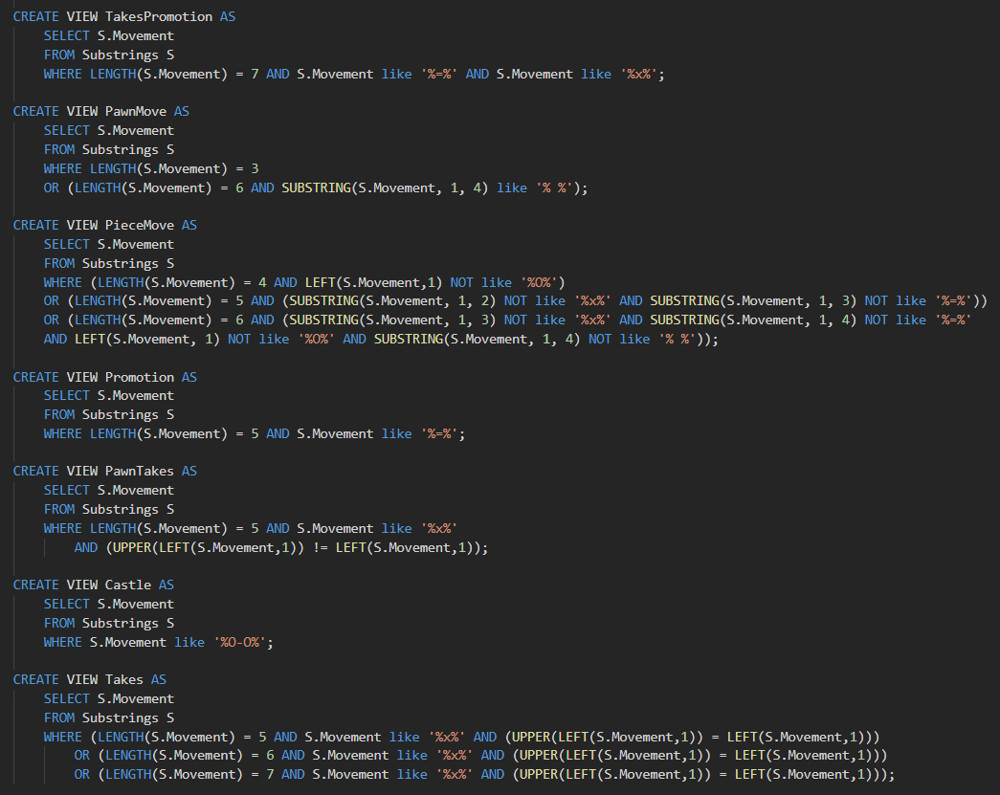

# Modelo para Apresentação da Entrega Prévia do Projeto

# Projeto `<BispOSet: Chess Match and Titled Player Statistic Organized Dataset>`

# Equipe `BispOSet` - `BOSS`
* `Breno Nunes Tavares` - `RA: 232238`
* `Eduardo Carvalheira Teixeira de Aguiar` - `RA: 233686`
* `Enrico Piovesana Fernandes` - `RA: 233895`

## Resumo do Projeto
> Nosso projeto busca oferecer um dataset compreensivo e abrangente com diversos jogadores titulados e com grande variedade e quantidade de partidas com ênfase em quantidade para facilitar diversas análises possíves sobre o comportamento dessas partidas e desses jogadores.

## Slides da Apresentação
> 

## Modelo Conceitual

> 

## Modelos Lógicos

# Modelo lógico relacional
~~~
PLAYER(_username_, title, bullet_rating, blitz_rating, rapid_rating, _site_name_)
GAMES(_id_, ranked, time_control, status, winner, white, black, moves, opening, site_name)
  winner chave estrangeira -> PLAYER(username)
  white chave estrangeira -> PLAYER(username)
  black chave estrangeira -> PLAYER(username)
  opening chave estrangeira -> OPENING(PGN)
OPENING(ECO, Opening, _PGN_)
~~~~

# Grafo de propriedades
> 

> Para o modelo de grafos de conhecimento, utilize a abordagem
> (recurso, propriedade, valor) para apresentar seu grafo exemplo.
> Coloque a imagem do PNG do seu modelo lógico como ilustrado abaixo (a imagem estará na pasta `image).
>
> Você pode usar um grafo ilustrando as classes, como este:
> 
>
> Além de outro com exemplo de instâncias, como este:
> 

> Para modelos hierárquicos (XML e JSON), utilize um formato
> conforme o abaixo:

> 

## Dataset Publicado
> Elencar os arquivos/bases preliminares dos datasets serão publicados.

título do arquivo/base | link | breve descrição
----- | ----- | -----
`<título do arquivo/base>` | `<link para arquivo/base>` | `<breve descrição do arquivo/base>`

> Os arquivos finais do dataset publicado devem ser colocados na pasta `data`, em subpasta `processed`. Outros arquivos serão colocados em subpastas conforme seu papel (externo, interim, raw). A diferença entre externo e raw é que o raw é em formato não adaptado para uso. A pasta `raw` é opcional, pois pode ser substituída pelo link para a base original da seção anterior.
> Coloque arquivos que não estejam disponíveis online e sejam acessados pelo notebook. Relacionais (usualmente CSV), XML, JSON e CSV ou triplas para grafos.
> Este é o conjunto mínimo de informações que deve constar na disponibilização do Dataset, mas a equipe pode enriquecer esta seção.

## Bases de Dados
> Elencar as bases de dados fonte utilizadas no projeto.

título da base | link | breve descrição
----- | ----- | -----
`Lichess API` | `https://lichess.org/api` | `Utilizou-se um wrapper para python disponível em` *https://python-lichess.readthedocs.io* `para a coleta de dados do site Lichess.org, junto com uma chave de autenticação para maior número de transações permitidas por minuto.`
`Chess.com API` | `https://www.chess.com/news/view/published-data-api` | `Utilizou-se o wrapper de python disponível em` *https://github.com/sarartur/chess.com* `para a coleta de dados do site Chess.com.`
`Lichess Tournament Webpage` | `https://lichess.org/blog/X0I7phAAACQAMCfH/titled-arena-announcements` | `Utilizou-se de web-scraping para obter links de torneios envolvendo jogadores titulados.`

## Detalhamento do Projeto

Nosso projeto pode ser dividido em partes, que vão desde a extração de dados da web utilizando APIs e webscraping à transformação e análise dos dados. São elas:

### Extração de dados de páginas na Web

Notebooks relacionados: 
* 

Primeiramente, é perceptível que nossa extração de dados foi feita focada no uso de APIs, no entanto utilizamos web-scraping em uma ocasião específica, como pode ser vista no começo do arquivo `lichess_fetcher`, onde nós obtemos o link de diversos torneios de jogadores titulados, para que possamos em seguida utilizá-las como "mini-databases" de usernames de jogadores para pegar seus jogos/informações. O processo está ilustrado no código a seguir.

~~~python
url = "https://lichess.org/blog/X0I7phAAACQAMCfH/titled-arena-announcements"
table_MN = pd.read_html(url)
titled_tournaments = table_MN[0]
def linkify(x):
    return x[9:-11]
titled_tournaments['Link'] = titled_tournaments['Link'].apply(linkify)
titled_tournaments['tag'] = titled_tournaments['Link'].apply(lambda x: x[31:])
titled_tournaments.head()
~~~

### Agregação de dados fragmentados obtidos a partir de API

A obtenção de dados utilizando APIs corresponde a maior parte de nosso projeto, visto que desde o começo do trabalho nosso objetivo era pegar a maior quantidade possível de jogos de jogadores titulados, dos dois maiores sites de xadrez disponíveis, que presumidamente serão todos de alto nível.

### Lichess

Notebooks relacionados: 
* 

Primeiramente, utilizamos a API do Lichess para que fosse possível formar uma lista de todos os jogadores que participaram nos torneios obtidos na etapa anterior. É importante destacar que a API do lichess foi utilizada através de um wrapper chamado `berserk`, e que para acelerar a obtenção de informações através da API foi necessária a utilização de um token privado gerado disponível em https://lichess.org/account/oauth/token/create, e utilizado como ilustrado no excerto de código a seguir.

~~~python
import berserk

session = berserk.TokenSession('INSERT_KEY')
client = berserk.Client(session=session)
~~~

A seguir, utilizamos loops para extrair o nome dos jogadores dos torneios obtidos, e em seguida, utilizando mais laços e o comando `get_rating_history(id)`, obtivemos o rating dos três formatos de tempo mais jogados nos sites - bullet, blitz e rapid. Por fim, agora que já tinhamos uma lista de players, bastava rodar o comando `export_by_player(username)`, que retorna um arquivo .json com inúmeras informações a respeito de todos os jogos jogados desde a criação da conta pelo jogador. Salvamos as informações que tinhamos interesse em diversas tabelas menores, para que no futuro pudéssemos juntá-las em uma tabela com todos os jogos de todos os sites.

### Chess.com

Notebooks relacionados: 
* 
* 

Após a obtenção dos dados do lichess, partimos para uma abordagem semelhante, mas para o site chess.com. Primeiramente, encontramos o wrapper disponível em `https://github.com/sarartur/chess.com`, que nos ajuda a utilizar os comandos da API em nosso código. Diferente do lichess, esta API possui o comando `chessdotcom.get_titled_players(title)`, que retorna uma lista de todos os jogadores que possuem o título desejado. Nós optamos por utilizar esse comando, o que apresentou pontos positivos, como acelerar bastante o processo de obtenção de nomes de jogadores, e pontos negativos, como pegar diversas contas de jogadores inativos/que não existem mais. Em seguida, realizamos um processo semelhante ao do Lichess para obter os ratings desejados de cada jogador.

A parte de obter os jogos de cada player foi mais complexa nesse caso. O melhor comando para isso foi o `chessdotcom.get_player_games_by_month(username, month, year)`, no entanto para obter os meses que o jogador possui jogos nós modificamos um código antigo encontrado no link `https://www.reddit.com/r/chess/comments/9ifkaq/how_i_downloaded_all_my_chesscom_games_using/` para retornar os meses em que o usuário possui jogos ao invés de retornar os jogos em si.

Em seguida, utilizamos o comando já mencionado para diversos jogadores, obtendo todos os jogos registrados em suas contas desde sua criação e repetindo o processo de salvar os jogos em tabelas menores para facilitar a navegação e a integração com o git.

### Integração entre databases e tratamento de dados

Notebooks relacionados: 
* 
* 
* 
* 
* 

Como já mencionado, a maior parte dos dados já era tratada assim que obtida da API, de modo que as tabelas do chess.com foram feitas moldadas nas tabelas do Lichess. No entanto, ainda foi necessário algum tratamento de dados, tais como:
* Tratamento de PGN
  
  * O PGN fornecido pela API do chess.com correspondia a uma descrição extremamente mais detalhada do que nós precisávamos para nossas análises, com informações que eram obtidas de outras maneiras (por exemplo os jogadores) ou ainda a informação de quanto tempo cada jogador possuia após realizar cada um de seus movimentos. O tratamento foi feito utilizando a função representada a seguir.
    ~~~python
    def trataPGN(pgn):
        # remove clock
        txt = '{\[%clk \d+:\d+:\d+(\.\d+)?\]}'
        a = re.sub(txt, "", pgn)

        # remove header
        txt = '\[.+\]'
        a = re.sub(txt, "", a)
        a

        # remove \n
        txt = '\\n'
        a = re.sub(txt, "", a)
        a
        
        return(a)    
    ~~~
    
* Integração das Openings
  
  * Após obtermos uma quantidade que julgamos ser suficiente de jogos, decidimos que seria interessante classificar cada uma das openings jogadas nesses jogos. Para isso, utilizamos as tabelas disponibilizadas em `https://github.com/niklasf/chess-openings`, que são basicamente uma organização da Enciclopédia de Openings em arquivos .tsv. Em seguida, tratamos novamente o PGN dos jogos de ambos os sites, para que ambos ficassem de acordo com o PGN utilizado nesses arquivos. Finalmente, foi possível rodar a função abaixo em todos os jogos que obtivemos até então, resultando em uma nova coluna, com o nome da opening de cada jogo, classificada.
    ~~~ python
    def encontraOpening(moves, openings):
      if type(moves) == float:
          return ''
      for i in range(0,len(openings)):
          moveString = openings['pgn'][i]
          if moveString in moves:
              return openings['name'][i]
      return ''
    ~~~

### Tranformação de dados para facilitar análise e pesquisa

Notebooks relacionados: 
* 

Para realizar as querys desejadas, nós fizemos diversas transformações nos dados obtidos, tais como:

* Junção de databases
  * Nessa etapa, tivemos que finalmente, realizar a junção entre as diversas tabelas menores em uma tabela que acabou ficando com aproximadamente 1 milhão de jogos. Ela não pode ser upada no github devido ao seu tamanho, mas pode ser gerada localmente utilizando o notebook `db_joiner`. Outra ressalva é que para realizar consultas em SQL nessa tabela é necessário no mínimo 16gb de memória RAM, para que seja possível evitar o erro `outofmemoryexception` ao criar a tabela no notebook `chesssql`.

* Atualização do PGN do lichess
  * Foi necessário realizar uma última mudança no PGN dos jogos provenientes do lichess, visto que os jogos do chess.com terminavam com o resultado da partida (por exemplo, 1-0 ou 0-1). Como uma tentativa de homogenizar isso de forma simples, adicionamos ` End` ao final de cada String de jogos do Lichess.

* Remoção de dados corrompidos em ambos os sites
  * Durante as consultas em SQL, percebemos que existiam diversos jogos com movimentos corrompidos, em que ao invés do nome da peça que estava se movimentando o caractere `@` era colocado. A função abaixo foi utilizada para resolver esse problema, o que nos fez remover aproximadamente 7.000 jogos.
    ~~~python
    def brokenFixer(x):
      if (type(x)==float):
          return x
      elif ("@" not in x):
          return x
      else:
          x = 'broken'
          return x
    ~~~

* Atualização dos dados do Lichess pra identificar o vencedor por username ao invés de cor
  * Novamente durante as consultas em SQL, percebemos que o Lichess salvava o vencedor de seus jogos pela cor ao invés do username do vencedor. Utilizamos a função abaixo para realizar essa mudança, salvando o nome do usuário que venceu.
    ~~~python
    def lichessFixer(white, black, winner):
      if winner == 'white':
          return white
      elif winner == 'black':
          return black
      else:
          return winner
    ~~~

* Atualização do nome dos resultados do chess.com para corresponder aos do lichess
  * Percebemos, durante as consultas, que alguns status que deveriam signficar a mesma coisa em sites diferentes tinham nomes diferentes. A função abaixo resolve o problema.
    ~~~python
    def resignerplus(x):
      if x == 'resign':
          return 'resigned'
      elif x == 'agreed':
          return 'draw'
      else:
          return x
    ~~~

## Evolução do Projeto
  O projeto começou com a ideia de obter apenas partidas de torneios e implementar torneios, mas a ideia mudou para obter partidas gerais de todos os jogadores titulados que conseguissemos encontrar, para obter o maior número possível de dados.

  O primeiro problema que encontramos foi o escopo do nosso projeto: inicialmente tinhamos como objetivo catalogar todos os jogos de jogadores titulados de ambas as plataformas, no entanto, conforme o número e jogos cresceu exponencialmente, rapidamente atingindo 1 milhão de jogos, e com isso vimos que poderiamos apenas cobrir cerca de 200-300 jogadores. Devido a restrições de tamanho máximo de arquivo no GitHub, para solucionar isso, o projeto foi separado em multiplos arquivos .csv menores, com centenas de MB cada, que devem ser juntados localmente através do notebook db_joiner.ipynb, para fazer um unico arquivo .csv de mais de 1 GB.

  O segundo problema foi que os sites não tinham uma notação padronizada para o PGN de seus jogos, para que ambos pudessem ser processados usando os mesmos algoritmos, tivemos que converter a sintaxe de um dos sites, escolhemos a notação do Chess.com por ser mais simples e aplicamos as transformações nos PNGs do site Lichess.

  O terceiro problema foi encontrado quando consideramos que as pessoas poderiam usar o dataset para descobrir a opening utilizada em cada jogo e vimos que, através do SQL, tal processamento seria de grande complexidade, então optamos por fazer esse o pré-processamento dessas informações. Pegamos, portanto, a notação das jogadas do livro "Encyclopaedia of Chess Openings" e portamos elas para um arquivo .csv. No entanto, o processo de classificação precisava testar todas as aberturas possíveis para cada jogo indivualmente no algoritmo de classificação, o que levava horas. Então classificamos as aberturas em ordem descrescente do tamanho de seus PGNs, que significa que a primeira jogada encontrada que coubesse era a abertura mais extensa e não se precisava fazer várias verificações, resultando em um algoritmo muito mais rápido.

## Perguntas de Pesquisa/Análise Combinadas e Respectivas Análises

> Apresente os resultados da forma mais rica possível, com gráficos e tabelas. Mesmo que o seu código rode online em um notebook, copie para esta parte a figura estática. A referência a código e links para execução online pode ser feita aqui ou na seção de detalhamento do projeto (o que for mais pertinente).

> Liste aqui as perguntas de pesquisa/análise e respectivas análises. Nem todas as perguntas precisam de queries que as implementam. É possível haver perguntas em que a solução é apenas descrita para demonstrar o potencial da base. Abaixo são ilustradas três perguntas, mas pode ser um número maior a critério da equipe.
>
### Perguntas/Análise com Resposta Implementada

> As respostas às perguntas podem devem ser ilustradas da forma mais rica possível com tabelas resultantes, grafos ou gráficos que apresentam os resultados. Os resultados podem ser analisados e comentados. Veja um exemplo de figura ilustrando uma comunidade detectada no Cytoscape:

#### Pergunta/Análise 1
> * Quantidades e Tipos de Roques em Partidas
>   
>   * A análise propõe compararmos o número de partidas e os tipos de roques para identificar qual a jogada mais feita entre os jogadores. A análise foi realisada em SQL utilizando método de Substrings para conseguir-se diferenciar Roques Curtos de Grandes. 
>* 
>   * Como podemos perceber pela imagem, temos que Roques Curtos são representados pelo texto "O-O" e Roques Longos representados por "O-O-O". Para não ocorrer a intersecção das substrings tivemos que descobrir quais são os simbolos que acompanham o roque, sendo eles o espaço, indicando que a jogada ocorreu normalmente, o simbolo "+", indicando que após o roque houve xeque e por útlimo o símbolo "#", indicando que após o roque houve Xeque-Mate. Os seguintes resultados foram obtidos:
>* 
>   * Como podemos perceber, roques curtos são mais realizados que longos, como também, que a média de roques por partida é superior a 1, o que faz sentido, visto que ambos os jogadores podem realizar a jogada. A dificuldade desta query é mediana.

#### Pergunta/Análise 2
> * Porcentagem de Tipos de Xeque Mate relacionado ao Total
>   
>   * Analisaremos, desta vez, o movimento de Xeque-Mate de uma partida, visando obter as porcentagens de qual foi o movimento realizado para o término da partida. Para isto, primeiramente realizou-se uma filtragem dos PGNs das partidas, selecionando as que terminam em "#" indicando o movimento. Além disso, foi criada uma tabela auxiliar que listava todas as últimas jogadas destes jogos.
>* 
>   * Posteriormente selecionamos 7 tipos de jogadas que podem resultar mate e as filtramos segundo o seu padrão de texto em um PGN (Portable Game Notation), sendo elas:
>     * `O movimento de peão`, que são representados por letras minúsculas da casa de destino;
>     * `A captura de uma peça por um peão`, representado pela letra minuscula da fileira de origem do peão, de um "x" que representa a captura e da casa de destino;
>     * `A promoção de um peão`, representado pela casa de destino do peão, seguido do símbolo de "=" indicando a promoção e por ultimo uma letra maíuscula indicando qual foi a promoção ocorrida;
>     * `A promoção de um peão feita através de uma captura`, em que o peão captura uma peça e, ao capturar, atinge a casa de promoção, assim, apresentando os símbolos "+" e "=" na sua string;
>     * `Roque`, representados pelos movimentos "O-O" e "O-O-O";
>     * `O movimento de peças superiores a peões`, representado por uma letra maiúscula indicando a peça seguido de sua casa de destino;
>     * `A captura de uma peça por uma peça superior`, representado por uma letra maiúscula indicando a peça, seguido do simbolo de captura "x" e a casa de destino;
>* 
>    * Por ultimo, fizemos a query e obtivemos os seguintes resultados:
>* 
>* 
>    * Como podemos perceber, o jeito mais fácil de chegar-se em um Xeque-Mate é com a movimentação de peças superiores, obtendo 72% do total, e por último temos o movimento do roque, que é normalmente utilizado para proteger o Rei obtendo uma porcentagem de 0.008%. Esta query tem uma dificuldade alta.

#### Pergunta/Análise 3
> * Com qual peça é mais feita Xeque Mate
>   
>   * Aprofundando mais ainda no quesito de Xeques-Mate, podemos identificar as peças que finalizam com o jogo, assim, utilizando os 7 tipos de movimentos citados anteriormente podemos filtrar os dados por peça utilizada. Em um jogo de xadrez temos as seguintes peças:
>     * `Rei`, representado pela letra maíuscula "K" em um PGN;
>     * `Rainha`, representado pela letra maíuscula "Q" em um PGN;
>     * `Torre`, representado pela letra maíuscula "R" em um PGN;
>     * `Bispo`, representado pela letra maíuscula "B" em um PGN;
>     * `Cavalo`, representado pela letra maíuscula "K" em um PGN;
>     * `Peão`, representado por letras minúsculas de posição em um PGN;
>* 
>   * Após a filtragem, realizamos a contagem de cada caso, listando-os em uma tabela, obtendo os seguintes resultados
>* 
>* 
>   * Podemos perceber que a rainha é a peça "mais matadora", isto pode ser explicado pelo fato que ela controla mais casas ao mesmo tempo se comparada com as outras peças. Além disso, jogadas em que o rei se move para que outra peça realize o Xeque-Mate são considerados Mates pelo Rei, que são extremamente raras. Esta Query tem uma dificuldade alta.

### Perguntas/Análise Propostas mas Não Implementadas

#### Pergunta/Análise 1
> * Qual a casa que o Rei mais toma Xeque-Mate?
>   
>   * A base, por conter o PGN do jogo apresenta toda a evolução da partida, assim, pode-se rastrear a movimentação do rei, identificando a casa de "morte" do rei. Seria interessante esta análise para identificarmos, tanto para Brancas, quanto para Pretas, quais são as casas mais fatais para esta peça. A dificuldade desta query é elevadíssima devido a dificuldade de se manipular Strings em SQL e também a presença do movimento de Roque, que não indica que a peça do Rei foi movida, assim, seria preciso muitas pequenas checagens para indicar o local corretamente.

#### Pergunta/Análise 2
> * Qual a coluna que promove mais peões?
>   
>   * Novamente, por conta do PGN, podemos identificar uma jogada de promoção quando há a presença do sinal "=", que é conectado a letra da coluna de origem do peão. Assim, poderiamos notar se peões mais centrais tem uma maior probabilidade de serem promovidos se comparados com peões das bordas, por exemplo. Esta query requer uma difuculdade mediana, visto que somente precisariamos encontrar o sinal de "=" na string e seu antecessor.

#### Pergunta/Análise 3
> * Qual é a primeira peça mais capturada?
>   
>   * Podemos identificar utilizando a sequencia de jogadas de Xadrez a primeira ocorrencia do sinal de captura "x" para encontrar o momento que houve a captura, além disso, podemos analisar qual peça estava na casa destino da captura pela sequencia de jogadas. Assim, mapearemos as quantidades de captura de cada peça para encontrar o resultado desejado. A dificuldade desta query é elevadíssima devido a dificuldade de se manipular Strings em SQL e também a dificuldade de identificar qual peça estaria na casa de destino da captura, visto que, deveriamos manter salvos as localizações de todas as peças do tabuleiro.

> Coloque um link para o arquivo do notebook que executa o conjunto de queries. Ele estará dentro da pasta `notebook`.
>  

